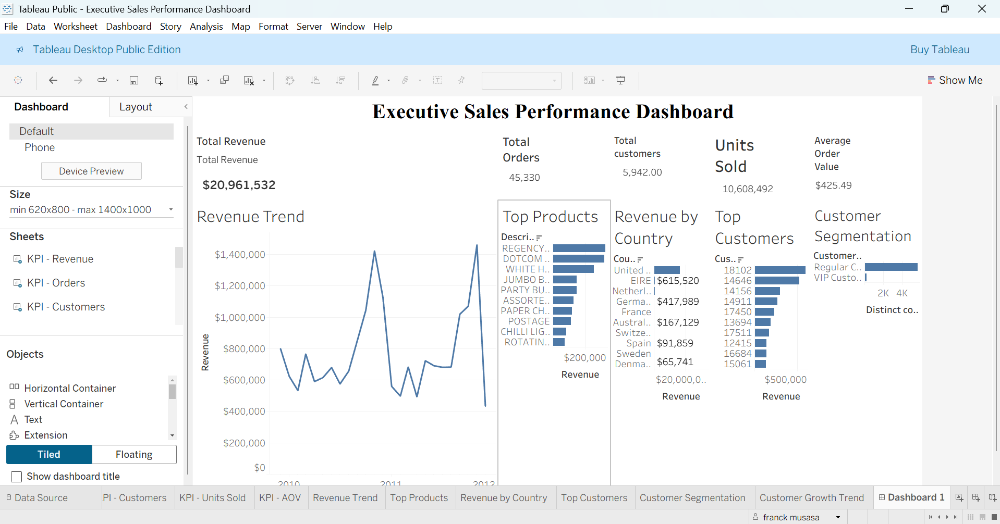

# Executive Sales Performance Dashboard

## Overview

## Overview

This project presents an Executive Sales Performance Dashboard developed in Tableau to analyze sales performance, customer behavior, and product trends using an online retail dataset.

The dashboard provides decision-makers with key business metrics and visual insights to support data-driven decision-making.

## Tools Used

* Tableau
* Excel
* Data Visualization
* Business Intelligence
* Dashboard Design

## Key Metrics

* Total Revenue: $20.96M
* Total Orders: 45,330
* Total Customers: 5,942
* Units Sold: 10.6M
* Average Order Value: $425.49

## Dashboard Features

### KPI Scorecards

* Revenue
* Orders
* Customers
* Units Sold
* Average Order Value

### Sales Analysis

* Revenue Trend Over Time
* Top Performing Products
* Revenue by Country

### Customer Analysis

* Top Customers
* Customer Segmentation

## Business Insights

* Generated over $20 million in total revenue.
* Processed more than 45,000 customer orders.
* Revenue is concentrated among a subset of top-performing products.
* Customer purchasing behavior varies across customer segments.
* Revenue distribution differs significantly across countries.

## Tableau Public Dashboard

https://public.tableau.com/app/profile/franck.musasa7776/viz/ExecutiveSalesPerformanceDashboard_17806243764500/Dashboard1

## Author

Franck Musasa

Big Data Science & Analytics Graduate

Aspiring Data Analyst
